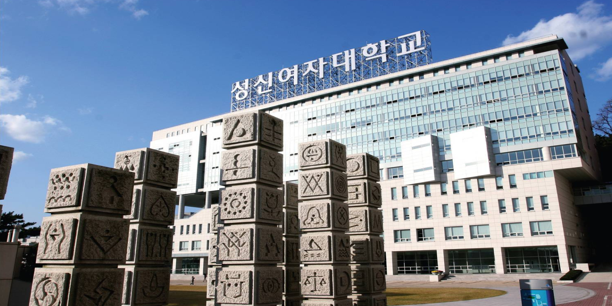
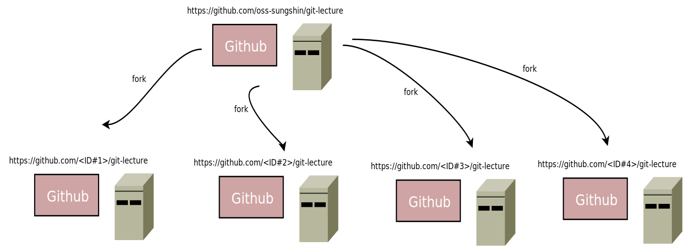
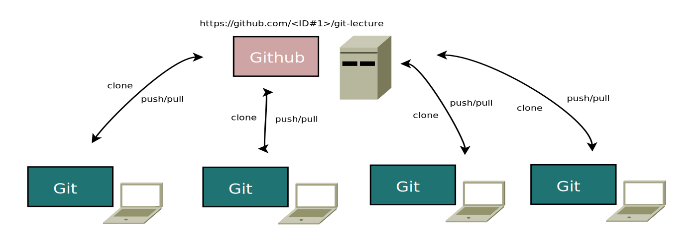

## 강의 노트
* [다운로드 클릭](https://github.com/oss-sungshin/git-lecture/raw/master/pdf/ci.pptx)

## 목표
* Webpage 프로젝트를 서로 협업하면서 작업을 진행.
* Markdown으로 구성된 페이지 수정 작업을 통해 git/github 사용법을 완벽 숙지한다. 

## PDF 문서
* [다운로드 클릭](https://github.com/oss-sungshin/git-lecture/raw/master/pdf/mydoc.pdf)

## 사용 언어
* 개발 프로젝트가 아닌 관계로 모든 작업은 Markdown을 기반으로 작성.
* Markdown 사용방법은 아래 사이트를 참고하세요.
* <https://guides.github.com/features/mastering-markdown>
* Markdown viwer 활용 <https://jbt.github.io/markdown-editor/>

## 실습 진행 방법
* 모든 실습자들은 웹 프로젝트(<https://github.com/oss-sungshin/git-lecture>)의 소스를 수정하면서 발생되는 문제를 2명의 강사와 함께 
해결한다.
* 실습 진행 도중 여러 이벤트(브랜치 작업, 개발 도중 머지) 들의 미션이 발생되며, 강사와 
함께 문제점을 같이 해결한다.

## Git 내용 참고 사이트 
* <https://git-scm.com/book/ko/v1>

## 2월 9일(목)시간표

* 10:00 ~ 11:50 : 실습 진행 방법 설명, 팀 빌딩, 실습 진행
* 11:00 : 브랜치 후 작업 진행 (강사 개별 지도)
* Event #1(11:20) : 1차 머지(팀원 push -> 팀장 pull request -> 서버)
    * 원격 저장소(oss-sungshin)를 등록한다.
    * 개별 브랜치 및 머지 충돌을 실습한다.  
    * 팀장은 팀 저장소를 업데이트 한다.
* Event #2(15:10) : 2차 머지(팀원 push -> 팀장 pull request -> 서버)
    * 개별 브랜치 및 머지 충돌을 실습한다.  
    * gitk를 통해 커밋 로그를 분석한다.
    <!--- * Stash 사용 방법을 실습한다. --->
* Event #3(16:00) : 커밋 가져오기
    * 최근 oss-sungshin 커밋을 팀장 github 저장소에 적용하기(git cherry-pick)
    <!--- * 최근 patch 파일 1개를 추출 후 각 팀에 전달(git format-patch -1) --->
* Event #4(16:30) : 팀별 커밋 내용 공유 및 설명(강사 진행)
    * 내용 공유

## 2월 10일(금) 시간표
* 13:00 ~ 15:50 : 실습 진행 및 시상
* Event #5(13:20) : 4차 머지(팀원 push -> 팀장 pull request -> 서버)
    * 머지 문제 해결
* Event #5(14:00) : reset 실습
    1. 현재 커밋 백업  (git format-patch -2)
    2. 과거 커밋으로 이동 (git reset COMMIT_ID)
    3. 백업 커밋 적용  (git am 이용)
* Event #5(15:00) : 최종 머지 및 작업 내용 발표
    * 작업 한 내용 서로 공유
* Event #5(15:30) : 종합 및 시상식
 
## 팀장이 해야 할 일
* 자신의 github에 oss-sungshin 프로젝트 fork 하기 

* 팀원 github 계정을 프로젝트에 등록하기

* 통합은 pull request를 사용하여 병합 할 예정

    
## 팀원이 해야 할 일
* 팀장의 github 프로젝트를 local PC에 clone 하기

## 팀별 결과 공유 및 시상
최종 결과물은 아래 페이지에 영구 보존되며,
우수 팀은 팀별 경품이 있습니다.

